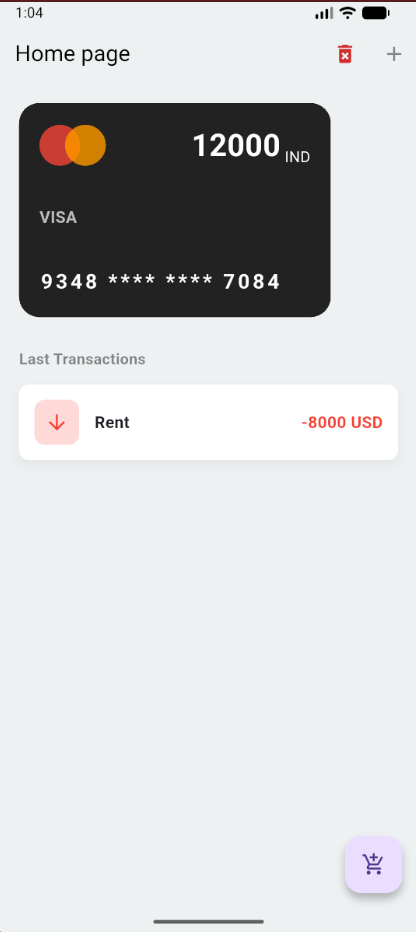
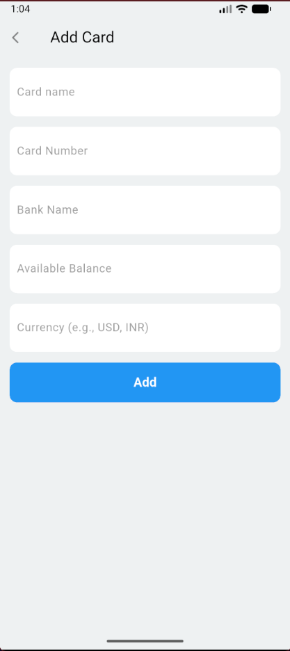

Flutter Expense Manager

A complete expense tracking application built with Flutter. This app demonstrates a robust state management approach using the Provider package, linked providers, and Shared Preferences for data persistence.

This project allows users to manage multiple bank cards and track all expenses and income, with balances updating in real-time.

🚀 Features
Card Management: Add and delete multiple bank/credit cards.

Transaction Management: Add expenses and income (salary, etc.). All transactions are saved persistently.

Linked Balances: When you add a transaction, the balance on the selected card is automatically updated.

Persistent Storage: App data (cards and transactions) is saved locally using SharedPreferences. Your data is still there even after you close the app.

Data Validation: Robust forms prevent adding empty cards or transactions.

Confirmation Dialogs: Protects against accidental deletion of cards or resetting all data.

Master Reset: A "Reset" button in the app bar to safely clear all saved data and start fresh.

📦 Core Packages Used
provider: Used for managing app-wide state for both cards and transactions.

shared_preferences: Used for local data persistence (saving cards and transactions).

📱 Screenshots

⚙️ How to Run

Install dependencies:

flutter pub get

Run the app: Make sure you have an emulator running or a device connected.

flutter run
